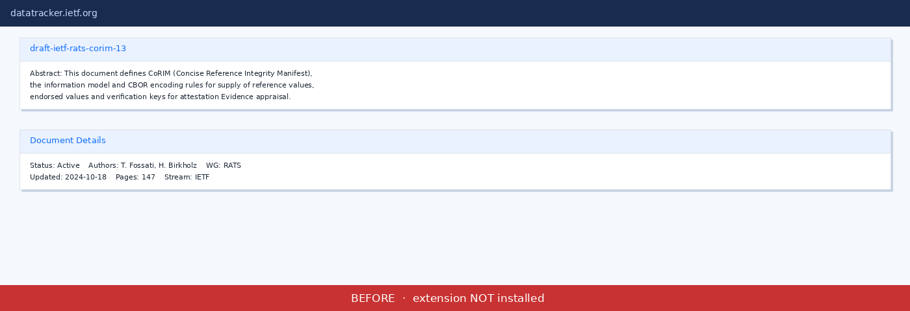
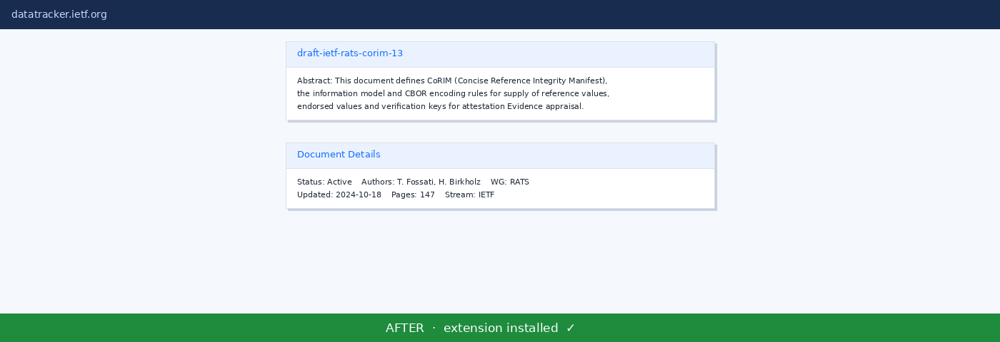

# 🔍 IETF Document Fixer

> *In the year of our Lord 2024, reading an IETF document on a modern widescreen monitor requires the same squinting, neck-craning, and existential suffering as trying to spot a typo on a highway billboard from a moving car. The text stretches from one edge of your monitor to the other like it's trying to achieve some kind of world record for longest line length. RFC editors, we love you, but this is not it.*
>
> *This browser extension fixes that. You're welcome.*

---

## What does it do?

Injects a small CSS fix on every page under `https://datatracker.ietf.org/doc/*` that constrains the `.card-body` elements to a sensible reading width, centres them, and left-aligns the text — so documents look like documents, not ASCII art panoramas.

```css
.card-body {
  max-width: 600px;
  margin: 0 auto;
  text-align: left;
}
```

## Before & After

### Before — your eyes, betrayed



### After — reading like a civilised human being



---

## Installation (Microsoft Edge / Chrome)

> The extension uses **Manifest V3** and works in any Chromium-based browser (Edge, Chrome, Brave, etc.).

1. **Download or clone** this repository to your machine.
2. Open your browser and navigate to the extensions page:
   - **Edge:** `edge://extensions`
   - **Chrome:** `chrome://extensions`
3. Enable **Developer mode** (toggle in the top-right corner).
4. Click **Load unpacked**.
5. Select the root folder of this repository (the one containing `manifest.json`).
6. The extension will appear in your browser toolbar. Visit any `https://datatracker.ietf.org/doc/` page and enjoy text that doesn't require a panoramic display to read.

---

## Contributing

PRs welcome. If you find other IETF layout crimes that need fixing, open an issue.

## License

[MIT](LICENSE)
